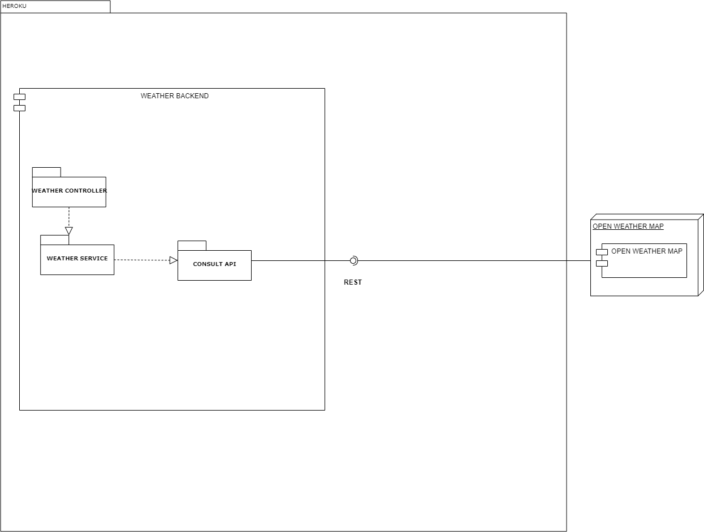
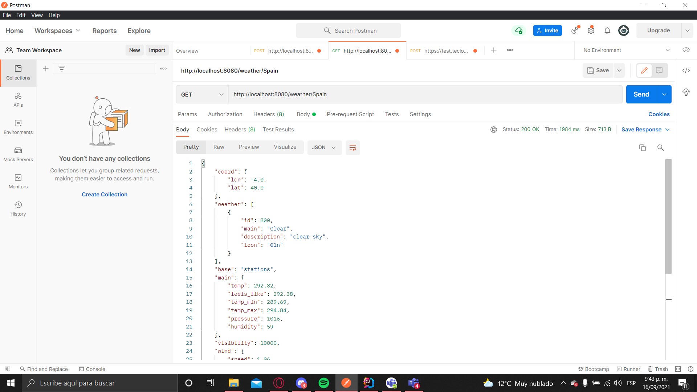

# PRUEBAS BACKEND TECLOGI

## Objetivo

Con el objetivo de preparar el examen final del segundo tercio, por favor siga las siguientes instrucciones.

1. Explore el API de OpenWeather en el siguiente [enlace](https://openweathermap.org/ ).
2. Use la colección de Postman adjunta para validar el funcionamiento del endpoint por fuera de la página de OpenWeather.

## Descripción del Problema a Solucionar


La arquitectura debe tener las siguientes características.

1. Se creo un cliente web asincrono que usa servicios REST
2. Se emplearon protocolos de comunicación sobre HTTP
3. Los formatos de los mensajes de intercambio son siempre JSON.
4. La aplicación estará desplegada en Heroku.
5. El servidor de Heroku servirá como un gateway para encapsular llamadas a otros servicios Web externos.

AJUSTE LOS DIAGRAMAS DE ARQUITECTURA QUE SEAN NECESARIOS PARA REFLEJAR LAS DESICIONES DE ARQUITECTURA QUE TOMO SOBRE EL DESARROLLO DEL PARCIAL.



* Como se hace la petición desde postman ejecutando el programa localmente
```
 - http://localhost:8080/weather/{CityName}
```
* Ejemplo :
  

* Entreda

```
 - http://localhost:8080/weather/Spain
```

* Salida
```
 {
    "coord": {
        "lon": -4.0,
        "lat": 40.0
    },
    "weather": [
        {
            "id": 800,
            "main": "Clear",
            "description": "clear sky",
            "icon": "01n"
        }
    ],
    "base": "stations",
    "main": {
        "temp": 292.82,
        "feels_like": 292.38,
        "temp_min": 289.69,
        "temp_max": 294.84,
        "pressure": 1016,
        "humidity": 59
    },
    "visibility": 10000,
    "wind": {
        "speed": 1.06,
        "deg": 261
    },
    "clouds": {
        "all": 5
    },
    "dt": 1631843656,
    "sys": {
        "type": 1,
        "id": 6443,
        "country": "ES",
        "sunrise": 1631858335,
        "sunset": 1631902933
    },
    "timezone": 7200,
    "id": 2510769,
    "name": "Spain",
    "cod": 200
}
```

[](https://laiton-arsw-t2.herokuapp.com)

## Elaborado por:
   Santiago Agustin Laiton Cubides


