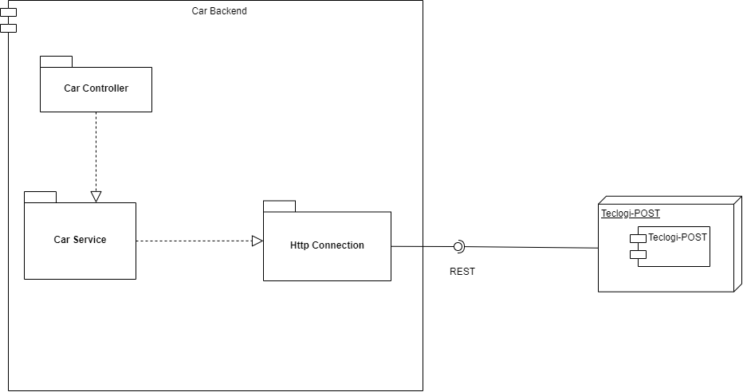
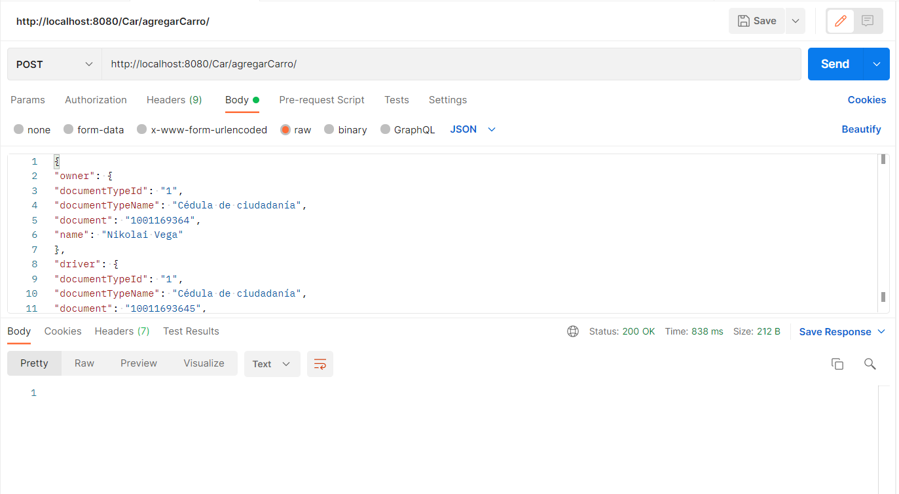
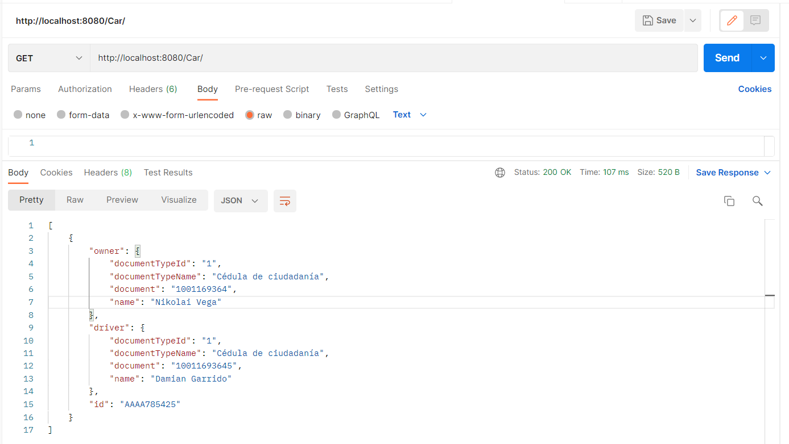
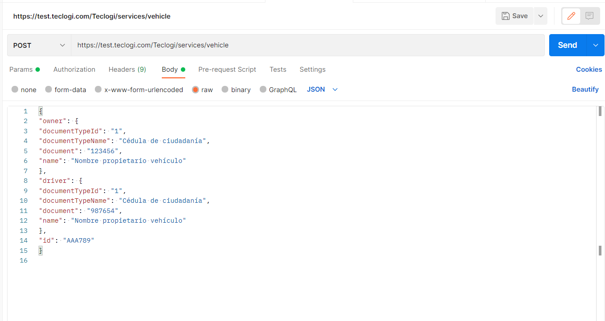
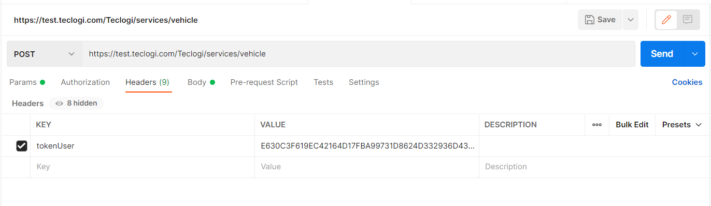

# PRUEBAS BACKEND TECLOGI


## Solución

Esta arquitectura cuenta con las siguientes caracteristicas.
1. Se creo un cliente web asincrono que usa servicios REST
2. Se emplearon protocolos de comunicación sobre HTTP
3. Los formatos de los mensajes de intercambio son siempre JSON.


* Diagrama


#### Explicación de ejecución 

* Como se hace la petición desde postman ejecutando el programa localmente y no se conecte con teclogi
```
 - http://localhost:8080/Car/agregarCarro/
```
* Ejemplo :
  

* Como se verifica que el POST fue exitoso

```
 - http://localhost:8080/Car/
```

* Salida
```
 [
    {
        "owner": {
            "documentTypeId": "1",
            "documentTypeName": "Cédula de ciudadanía",
            "document": "1001169364",
            "name": "Nikolai Vega"
        },
        "driver": {
            "documentTypeId": "1",
            "documentTypeName": "Cédula de ciudadanía",
            "document": "10011693645",
            "name": "Damian Garrido"
        },
        "id": "AAAA785425"
    }
]
```

* Ejemplo



* POST con Teclogi
  


* Header de Teclogi




## Elaborado por:
   - Santiago Agustin Laiton Cubides
   - Santiago.laitoncubides@hotmail.com


